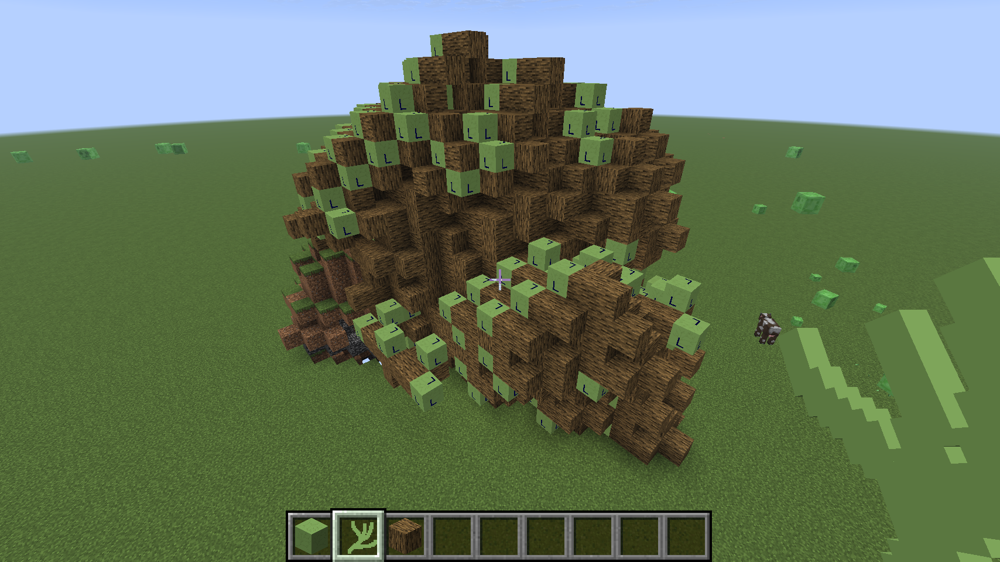

# L-SyStem Mod

A simple for OOP2 where an extensive [https://en.wikipedia.org/wiki/L-system](L-System) syntax can be build using just Minecraft blocks.

## Blocks & Items

The mode provides a single Block (variable) and an activator stick. The variable can be changed to an arbitrary ASCII index by right-clicking on it with the reight mouse and a empty hand. Once you are happy with your setup, you can right click with the activator stick to start a generation step!

